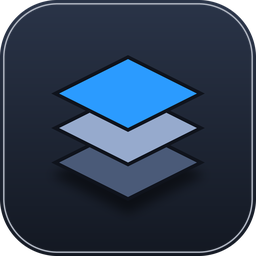

<p align="center">
  
</p>

# LayerLab

[日本語](#japanese) · [English](#english) · [한국어](#korean)

<a id="japanese"></a>
## 日本語

LayerLabは、Windows向けのオフライン画像・テクスチャ編集アプリです。バナーやサムネイルの制作、Unity / VRChatで使うテクスチャの編集を想定しています。レイヤーを使った画像編集と、チャンネルパック・ノーマルマップ生成を同じアプリで行えます。

個人開発中のソースコードを公開しています。アプリのUIは日本語と英語に対応しています。韓国語はこのREADMEで案内しています。

### できること

| 作業 | 機能 |
| --- | --- |
| 画像を組み合わせる | レイヤー、グループ、複数選択、並べ替え、ブレンド、クリッピング、ロック、名前検索、カラーラベル |
| 文字や図形を作る | テキスト、フォント選択、文字効果、長方形・楕円・線、整列、ガイド |
| 描く・選択する | ブラシ、消しゴム、長方形・楕円選択、なげなわ、自動選択、塗りつぶし、切り抜き |
| 色を調整する | 明るさ・コントラスト、レベル、カーブ、露光量、色相・彩度、カラーバランス、白黒 |
| テクスチャを作る | RGBAチャンネルパック、ノーマルマップ、PBRマップ生成、ライティング・タイルプレビュー |
| 保存・書き出す | `.llab`で編集状態を保存、PNG / JPEGで画像を書き出し、一括書き出し、複数ドキュメントのタブ編集 |

### 起動する

Windows、Git、Node.js 22以降、npmを用意してください。最初の依存パッケージ取得にはインターネット接続が必要です。セットアップ後の画像編集はローカルで行います。

```bash
git clone https://github.com/MKanasugi000/layerlab.git
cd layerlab
npm ci
npm run dev
```

Electronのアプリウィンドウが開きます。通常のブラウザプレビューでは、ネイティブのファイル保存やシステムフォント取得などは利用できません。

### 最初の編集

1. **ファイル → 新規**でキャンバスを作成するか、**開く**で画像・PSD・`.llab`を開きます。
2. **ファイル → 画像を配置**で素材を追加し、左のツールと右のレイヤー・プロパティパネルで編集します。
3. **Ctrl+S**で`.llab`を保存します。レイヤーを残して後から編集できます。
4. 完成画像は**ファイル → 書き出し**からPNG / JPEGで保存します。透明背景にはPNGを使います。

| ショートカット | 操作 |
| --- | --- |
| `Ctrl+Z` / `Ctrl+Shift+Z` | 取り消し / やり直し |
| `Ctrl+S` / `Ctrl+Shift+S` | 保存 / 名前を付けて保存 |
| `Ctrl+Shift+N` | 透明な新規レイヤー |
| `Ctrl+J` | レイヤー複製。選択範囲がある場合は選択部分を新規レイヤーへコピー |
| `Space`を押しながらドラッグ | 一時的に手のひらツールで移動 |
| `Ctrl+0` | キャンバスを画面に合わせる |

全ショートカットは**ヘルプ → キーボードショートカット一覧**で確認できます。言語は**表示 → 言語 / Language**から変更できます。

### ファイル形式と現在の制約

- 画像の読み込み：PNG、JPEG、WebP、BMP、GIF。画像の書き出し：PNG、JPEG。
- PSD / PSBは**読み込み専用**です。テキストやシェイプは画像レイヤーとして取り込み、一部の調整レイヤー・効果・ブレンドは省略または近似されます。Photoshopとの完全な往復互換はありません。元のPSDは残し、編集結果は`.llab`へ保存してください。
- キャンバスは1辺8192px、総画素数33,554,432以下です。ブラシ・チャンネルパック・ノーマル/PBR生成は最大4096×4096pxで、ファイルサイズやレイヤー合計にもメモリ上限があります。
- 作業内容は明示的に保存してください。自動保存・クラッシュ後の自動復元はありません。
- レイヤー結合は、見た目を保持できる連続したレイヤー・グループが対象です。半透明の親を残す部分結合や、外側に依存するクリッピングなどは理由を表示して中止します。
- 韓国語READMEの提供とアプリ内の韓国語UI対応は別です。配布用バイナリはソースに同梱していません。

### 開発と確認

Electron 44、React 18、TypeScript 5、Vite 6、Konva、Zustand / Zundo / Immerを使用しています。

```bash
npm test          # 操作・データ処理の回帰テスト
npm run build    # 型チェックとrenderer / Electronのビルド
```

ビルド結果は`dist/`と`dist-electron/`へ出力されます。`npm run build`だけでは配布用exeは生成しません。

### ライセンス

Copyright © 2026 Mild Solt. All rights reserved.

制作実績と実装内容の閲覧を目的にソースを公開しています。再配布、改変版の配布、販売、商用利用を許諾するオープンソースライセンスは付与していません。第三者コンポーネントには各ライセンスが適用されます。同梱フォントの出典は[フォントライセンス一覧](public/THIRD_PARTY_FONTS.txt)を参照してください。

<a id="english"></a>
## English

LayerLab is an offline image and texture editor for Windows. It is designed for banners, thumbnails, and textures used in Unity / VRChat. You can combine layers, edit images, pack texture channels, and generate normal maps in one application.

This repository contains the source of an independent project under active development. The app interface supports Japanese and English; Korean documentation is provided below.

### What you can do

| Task | Features |
| --- | --- |
| Compose images | Layers, groups, multiple selection, reordering, blending, clipping, locks, name search, color labels |
| Add text and shapes | Text, font selection, text effects, rectangles, ellipses, lines, alignment, guides |
| Paint and select | Brush, eraser, rectangle/ellipse selections, lasso, magic wand, fill, crop |
| Adjust colors | Brightness/contrast, levels, curves, exposure, hue/saturation, color balance, black and white |
| Create textures | RGBA channel packing, normal maps, PBR map generation, lighting and tile previews |
| Save and export | Editable `.llab` projects, PNG / JPEG export, batch export, multiple document tabs |

### Run the app

You need Windows, Git, Node.js 22 or later, and npm. An internet connection is needed to download dependencies during setup. Image editing runs locally afterward.

```bash
git clone https://github.com/MKanasugi000/layerlab.git
cd layerlab
npm ci
npm run dev
```

An Electron application window opens. A regular browser preview does not provide native file dialogs or system font discovery.

### Your first edit

1. Choose **File → New**, or **Open** an image, PSD, or `.llab` project.
2. Add artwork with **File → Place Image**, then edit with the left toolbar and the Layers and Properties panels on the right.
3. Press **Ctrl+S** to save a `.llab` project with editable layers.
4. Choose **File → Export** for the finished PNG / JPEG image. Use PNG when you need transparency.

| Shortcut | Action |
| --- | --- |
| `Ctrl+Z` / `Ctrl+Shift+Z` | Undo / redo |
| `Ctrl+S` / `Ctrl+Shift+S` | Save / save as |
| `Ctrl+Shift+N` | New transparent layer |
| `Ctrl+J` | Duplicate a layer, or copy selected pixels to a new layer |
| Hold `Space` and drag | Temporarily pan with the Hand tool |
| `Ctrl+0` | Fit the canvas to the screen |

See **Help → Keyboard Shortcuts** for the full list. Change the interface language under **View → Language / 言語**.

### Formats and current limitations

- Image import: PNG, JPEG, WebP, BMP, GIF. Image export: PNG, JPEG.
- PSD / PSB support is **import only**. Text and shapes become image layers; some adjustment layers, effects, and blend modes are omitted or approximated. Full Photoshop round-trip compatibility is not supported. Keep the original PSD and save your edits as `.llab`.
- Canvas limits are 8192px per side and 33,554,432 pixels in total. Brush operations, channel packing, and normal/PBR generation support up to 4096×4096px. File sizes and combined layer memory also have limits.
- Save your work explicitly. Autosave and automatic crash recovery are not available.
- Merge works on contiguous layers or groups whose appearance can be preserved. Partial merges inside translucent parents and clipping dependencies outside the selection are rejected with an explanation.
- Korean documentation does not imply a Korean app interface. Distribution binaries are not included in the source repository.

### Development and checks

Built with Electron 44, React 18, TypeScript 5, Vite 6, Konva, and Zustand / Zundo / Immer.

```bash
npm test          # Interaction and data-processing regression checks
npm run build    # Type-check and build the renderer and Electron code
```

Build output goes to `dist/` and `dist-electron/`. `npm run build` does not create a distributable exe.

### License

Copyright © 2026 Mild Solt. All rights reserved.

The source is published for reviewing the work and implementation. No open-source license granting redistribution, distribution of modified versions, sale, or commercial use is provided. Third-party components retain their own licenses. See [third-party font licenses](public/THIRD_PARTY_FONTS.txt) for bundled fonts.

<a id="korean"></a>
## 한국어

LayerLab은 Windows용 오프라인 이미지·텍스처 편집 앱입니다. 배너, 썸네일, Unity / VRChat용 텍스처 제작을 위해 개발하고 있습니다. 하나의 앱에서 레이어 기반 이미지 편집, 텍스처 채널 패킹, 노멀 맵 생성을 할 수 있습니다.

현재 개발 중인 개인 프로젝트의 소스 코드를 공개하고 있습니다. 앱 인터페이스는 일본어와 영어를 지원하며, 이 README에서는 한국어 사용 안내도 제공합니다.

### 주요 기능

| 작업 | 기능 |
| --- | --- |
| 이미지 합성 | 레이어, 그룹, 다중 선택, 순서 변경, 블렌딩, 클리핑, 잠금, 이름 검색, 색상 라벨 |
| 텍스트·도형 제작 | 텍스트, 글꼴 선택, 텍스트 효과, 사각형·타원·직선, 정렬, 안내선 |
| 그리기·선택 | 브러시, 지우개, 사각형·타원 선택, 올가미, 자동 선택, 채우기, 자르기 |
| 색상 보정 | 밝기·대비, 레벨, 곡선, 노출, 색조·채도, 색상 균형, 흑백 |
| 텍스처 제작 | RGBA 채널 패킹, 노멀 맵, PBR 맵 생성, 조명·타일 미리보기 |
| 저장·내보내기 | 편집 가능한 `.llab` 프로젝트, PNG / JPEG 내보내기, 일괄 내보내기, 여러 문서의 탭 편집 |

### 앱 실행

Windows, Git, Node.js 22 이상, npm이 필요합니다. 처음 의존성 패키지를 다운로드할 때는 인터넷 연결이 필요하며, 설치 후 이미지 편집은 로컬에서 수행됩니다.

```bash
git clone https://github.com/MKanasugi000/layerlab.git
cd layerlab
npm ci
npm run dev
```

Electron 앱 창이 열립니다. 일반 브라우저 미리보기에서는 기본 파일 대화 상자와 시스템 글꼴 검색 등의 기능을 사용할 수 없습니다.

### 첫 편집 시작하기

1. **File → New**로 캔버스를 만들거나, **Open**으로 이미지·PSD·`.llab` 프로젝트를 엽니다.
2. **File → Place Image**로 이미지를 추가한 뒤, 왼쪽 도구 모음과 오른쪽 레이어·속성 패널에서 편집합니다.
3. **Ctrl+S**로 `.llab` 프로젝트를 저장합니다. 레이어를 유지한 채 나중에 다시 편집할 수 있습니다.
4. 완성된 이미지는 **File → Export**에서 PNG / JPEG로 내보냅니다. 투명 배경이 필요하면 PNG를 선택하세요.

| 단축키 | 동작 |
| --- | --- |
| `Ctrl+Z` / `Ctrl+Shift+Z` | 실행 취소 / 다시 실행 |
| `Ctrl+S` / `Ctrl+Shift+S` | 저장 / 다른 이름으로 저장 |
| `Ctrl+Shift+N` | 새 투명 레이어 |
| `Ctrl+J` | 레이어 복제. 선택 영역이 있으면 선택한 픽셀을 새 레이어로 복사 |
| `Space`를 누른 채 드래그 | 임시 손 도구로 화면 이동 |
| `Ctrl+0` | 캔버스를 화면에 맞추기 |

전체 단축키는 **Help → Keyboard Shortcuts**에서 확인할 수 있습니다. **View → Language / 言語**에서 앱 언어를 변경할 수 있습니다. 위 메뉴 이름은 영어 UI 기준입니다.

### 파일 형식과 현재 제한 사항

- 이미지 불러오기: PNG, JPEG, WebP, BMP, GIF. 이미지 내보내기: PNG, JPEG.
- PSD / PSB는 **불러오기만 지원**합니다. 텍스트와 도형은 이미지 레이어로 변환되며, 일부 조정 레이어·효과·블렌드 모드는 생략되거나 유사한 방식으로 처리됩니다. Photoshop과의 완전한 왕복 호환은 지원하지 않습니다. 원본 PSD를 보관하고 편집 결과는 `.llab`으로 저장하세요.
- 캔버스는 한 변당 최대 8192px, 전체 33,554,432픽셀까지 지원합니다. 브러시·채널 패킹·노멀/PBR 맵 생성은 최대 4096×4096px까지 지원하며, 파일 크기와 레이어 전체 메모리에도 제한이 있습니다.
- 작업 내용은 직접 저장해야 합니다. 자동 저장과 비정상 종료 후 자동 복구는 지원하지 않습니다.
- 레이어 병합은 모양을 유지할 수 있는 연속된 레이어·그룹을 대상으로 합니다. 반투명 부모 그룹을 남기는 부분 병합이나 선택 영역 밖에 의존하는 클리핑은 이유를 표시하고 중단합니다.
- 한국어 README 제공과 앱의 한국어 UI 지원은 별개입니다. 배포용 실행 파일은 소스 저장소에 포함되어 있지 않습니다.

### 개발 및 확인

Electron 44, React 18, TypeScript 5, Vite 6, Konva, Zustand / Zundo / Immer를 사용합니다.

```bash
npm test          # 동작 및 데이터 처리 회귀 테스트
npm run build    # 타입 검사 및 renderer / Electron 코드 빌드
```

빌드 결과는 `dist/`와 `dist-electron/`에 생성됩니다. `npm run build`만으로 배포용 exe가 생성되지는 않습니다.

### 라이선스

Copyright © 2026 Mild Solt. All rights reserved.

제작 실적과 구현 내용을 확인할 수 있도록 소스를 공개하고 있습니다. 재배포, 수정 버전 배포, 판매 또는 상업적 사용을 허용하는 오픈 소스 라이선스는 부여하지 않았습니다. 타사 구성 요소에는 각각의 라이선스가 적용됩니다. 포함된 글꼴의 출처와 라이선스는 [글꼴 라이선스 목록](public/THIRD_PARTY_FONTS.txt)을 확인하세요.
